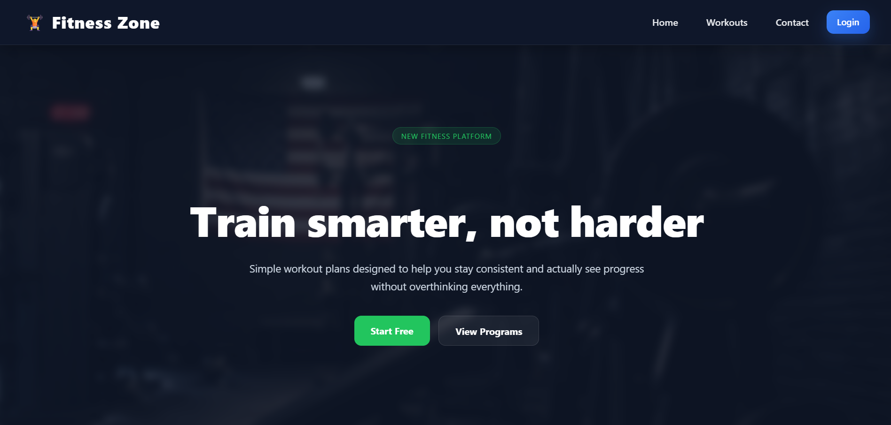
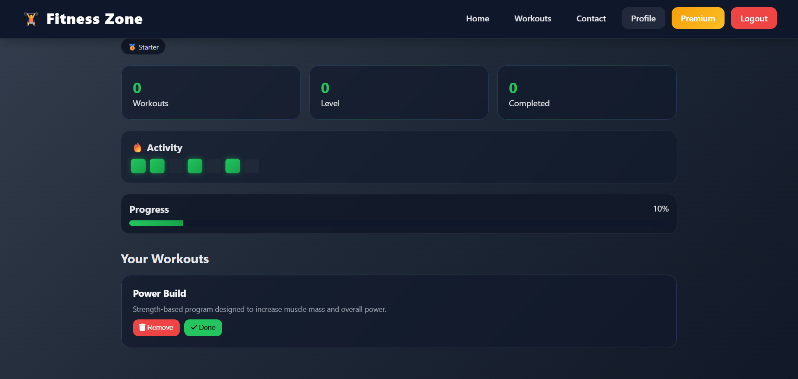
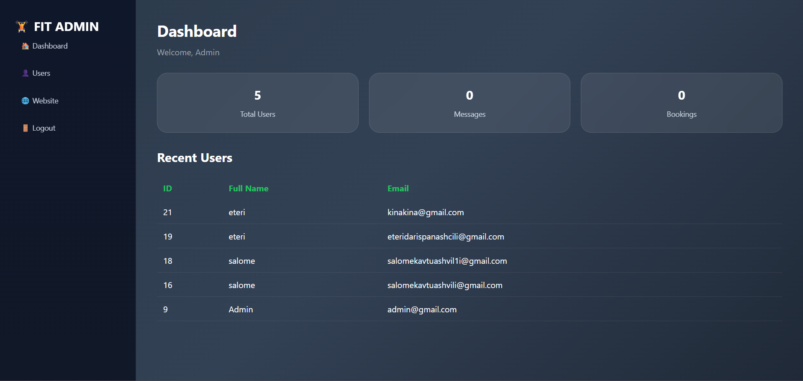

# Fitness Zone 💪

Fitness Zone is a fitness web application built with PHP, MySQL, HTML, CSS, and JavaScript.

The platform allows users to create an account, browse workout plans, track their progress, and access premium fitness content. It also includes an admin dashboard for managing workouts and users.

## Features

* User registration and login
* Session-based authentication
* User profile dashboard
* Workout plans
* Add and remove workouts
* Progress tracking
* Premium workout access
* Membership plans
* Admin dashboard
* User management
* Responsive design

## Technologies Used

* PHP
* MySQL
* HTML5
* CSS3
* JavaScript

## Screenshots

### Home Page

### Workouts Page

### Profile Page

### Premium Plans

### Admin Dashboard

## Author
salome

